# Training neural networks on the edge

Navjot Kukreja, Alena Shilova

Imperial College London, INRIA Bordeaux

---

Also:

 - Olivier Beaumont
 - Jan Huckelheim
 - Nicola Ferrier
 - Paul Hovland
 - Gerard Gorman

---

## Background

---

Seismic Imaging
---

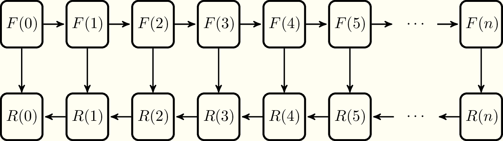

Typical data flow pattern for adjoint problems

---

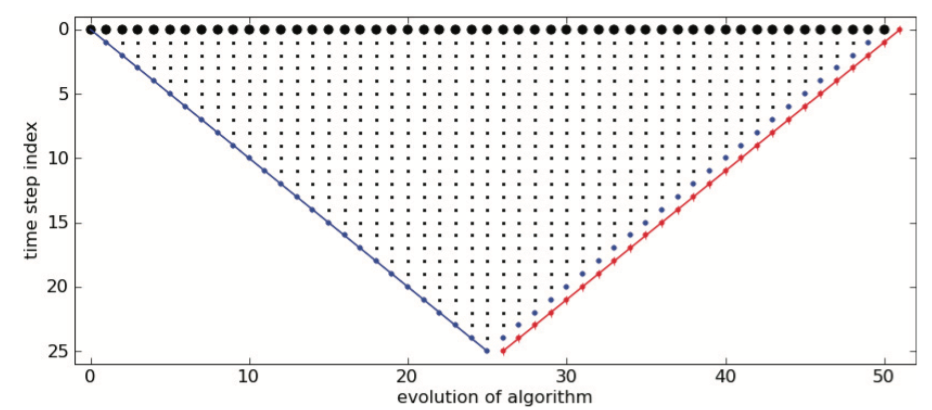

Memory consumption during an adjoint problem

---

Checkpointing (Revolve)

<iframe src="http://127.0.0.1:5000" width="100%"> </iframe>

---

Where else do we see the same data-access pattern?
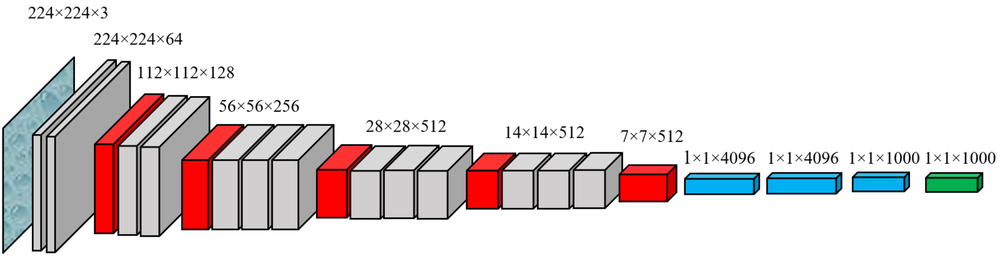

VGGNet

---

## Array of Things

---
## Waggle Payload Computer
- ODROID XU4 based on the Samsung Exynos5422 CPU
- four A15 cores, four A7 cores
- Mali-T628 MP6 GPU that supports OpenCL, 2GB
LPDDR3 RAM
- attached flash storage

---

## Viewpoint problem

---

## Student-teacher model

---

## Memory required to train ResNet 

---

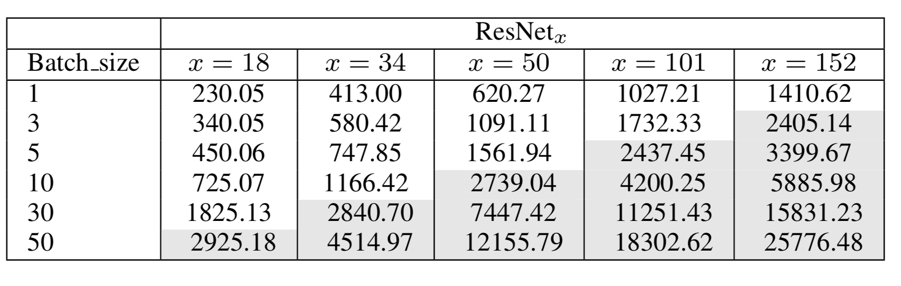

Memory required (GB) for image size $224 \times 224$

---

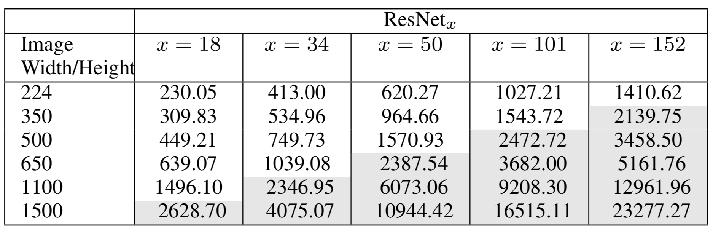

Memory required (GB) for batch size 1

---

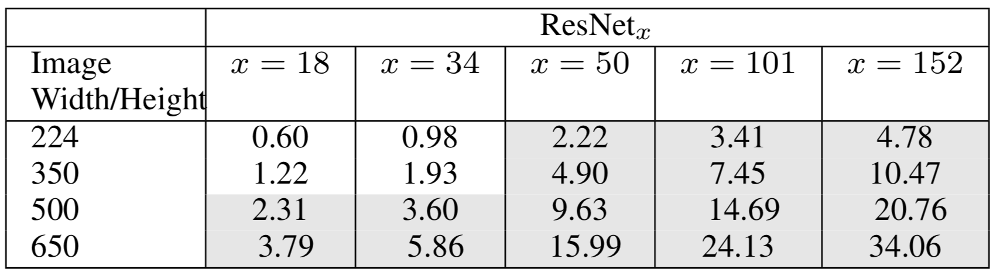

Memory required (GB) for batch size 8

---

## Checkpointing

---

PyTorch

* fast-evolving Python package widely applied in deep learning
* uses Tensors as a basic class
* Tensors are similar to NumPy arrays which also allow to work with them on GPU
* dynamically defines the computational graph of the model
* designed to be memory efficient: there is checkpointing strategy

---

Checkpoint sequential: number of segments = 2

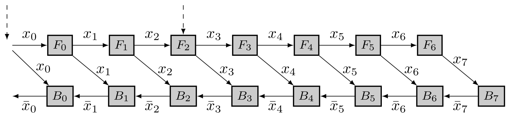

---

Checkpoint sequential: number of segments = 2

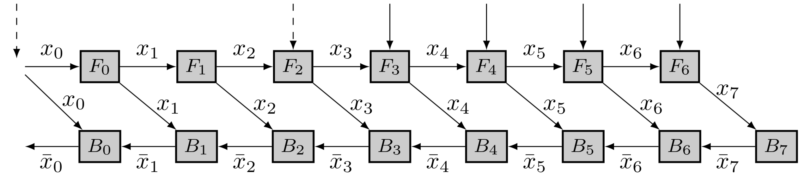

---

Checkpoint sequential: number of segments = 2

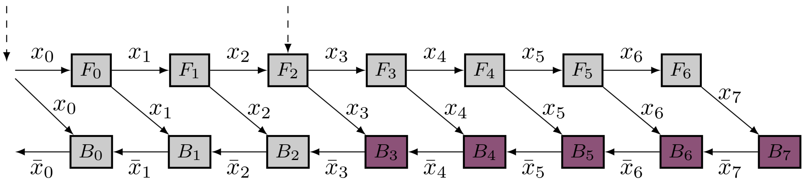

---

Checkpoint sequential: number of segments = 2

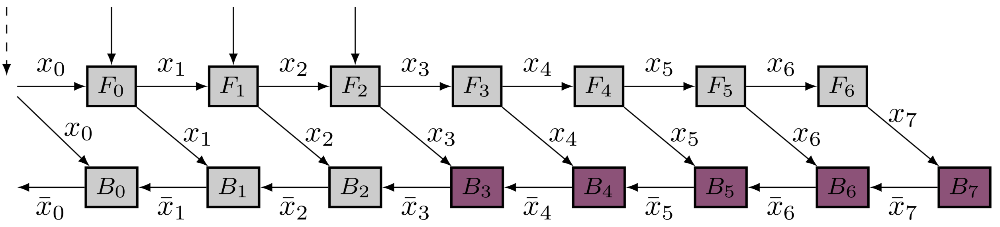

---

Checkpoint sequential: number of segments = 2

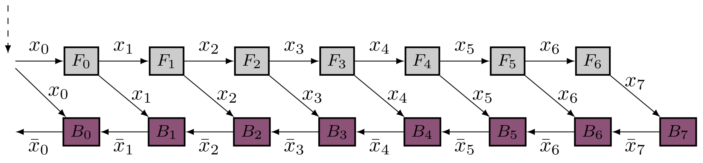

$$
\mbox{Memory} = s - 1 + \bigl(l - \left\lfloor l/s \right\rfloor (s -1) \bigr).
$$

---

Revolve: dynamic programming

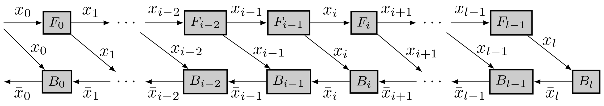

$$
\small{\mbox{Opt}[\ell,1] =  \frac{\ell (\ell +1)}{2} u_f  + (\ell+1 ) u_b}$$

 $$\small{\mbox{Opt}[1, c] = u_f +2 u_b}$$

$$\small{\mbox{Opt}[\ell, c] = \min_{1 \leq i \leq \ell-1} ( i u_f +\mbox{Opt}[\ell - i,  c -1] + \mbox{Opt}[i-1, c]) }$$

---

Comparison of Checkpoint sequential and Revolve

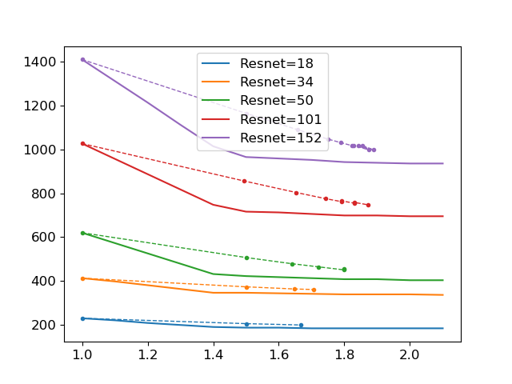

Batch Size: $1$, Image Size: $224 \times 224$

---

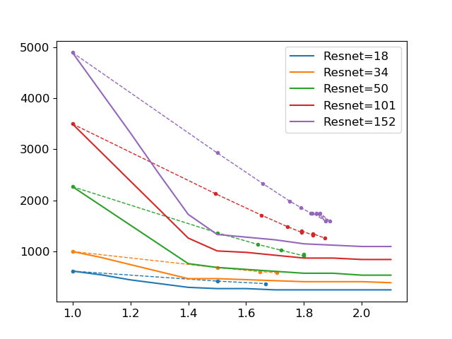

Batch Size: $8$, Image Size: $224 \times 224$

---

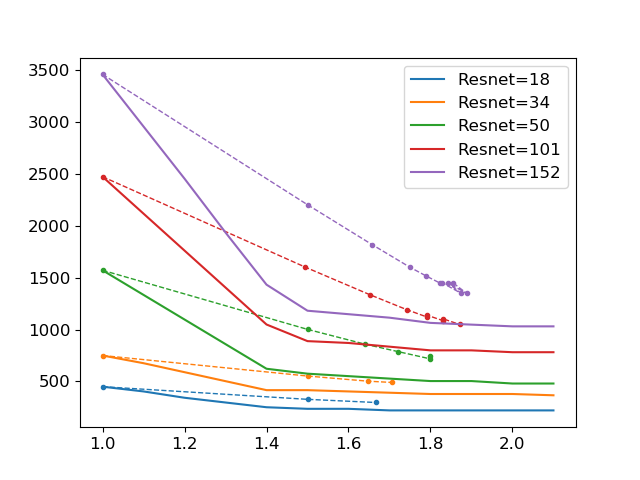

Batch Size: $1$, Image Size: $500 \times 500$

---

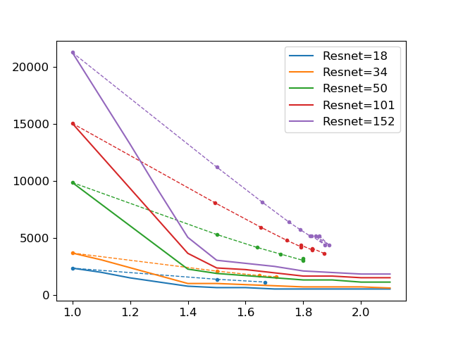

Batch Size: $8$, Image Size: $500 \times 500$

---
## Practical implementation and concluding remarks

---

# THANK YOU
