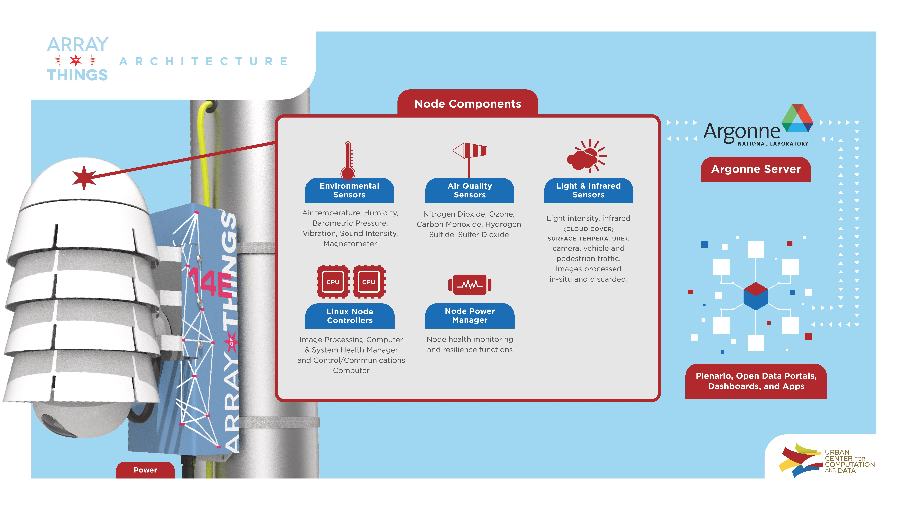

# Training neural networks on the edge

Navjot Kukreja, Alena Shilova

Imperial College London, INRIA Bordeaux

---

Also:

 - Olivier Beaumont
 - Jan Huckelheim
 - Nicola Ferrier
 - Paul Hovland
 - Gerard Gorman

---

## Background

---

Seismic Imaging
---

Typical data flow pattern for adjoint problems

---

Memory consumption during an adjoint problem

---

Checkpointing (Revolve)

<iframe src="http://127.0.0.1:5000" width="100%"> </iframe>

---

Where else do we see the same data-access pattern?

VGGNet

---

## Array of Things

---
## Waggle Payload Computer
- ODROID XU4 based on the Samsung Exynos5422 CPU
- four A15 cores, four A7 cores
- Mali-T628 MP6 GPU that supports OpenCL, 2GB
LPDDR3 RAM
- attached flash storage

---

## Viewpoint problem

---

## Student-teacher model

---

## Memory required to train ResNet 

---

Memory required (GB) for image size $224 \times 224$

---

Memory required (GB) for batch size 1

---

Memory required (GB) for batch size 8

---

## Checkpointing

---

Introduce Checkpoint Sequential

---

Comparison of Checkpoint sequential and Revolve

Batch Size: $1$, Image Size: $224 \times 224$

---

Batch Size: $8$, Image Size: $224 \times 224$

---

Batch Size: $1$, Image Size: $500 \times 500$

---

Batch Size: $8$, Image Size: $500 \times 500$

---
Practical implementation
